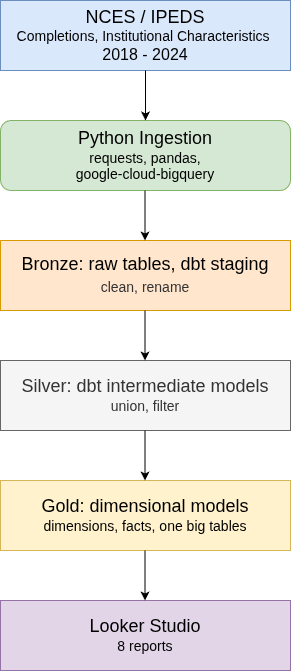
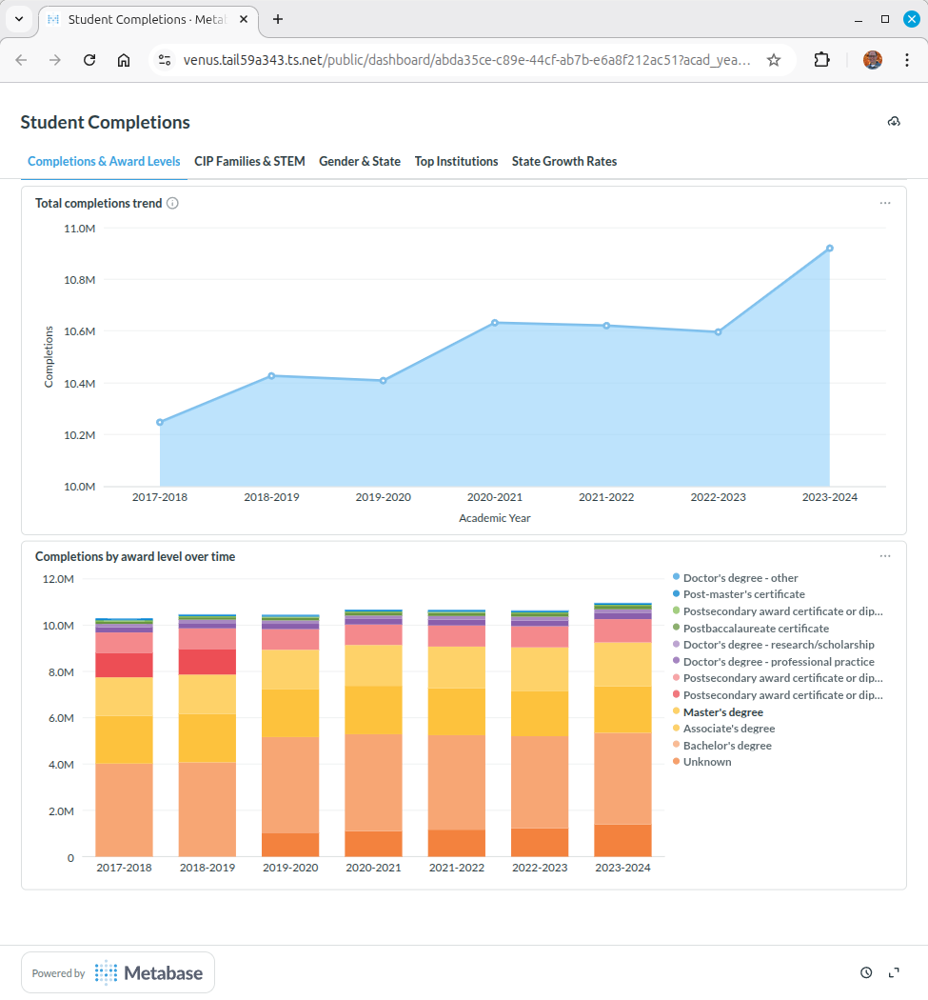
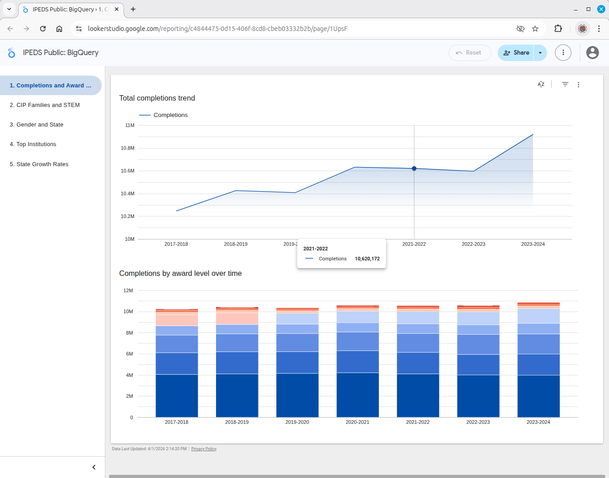
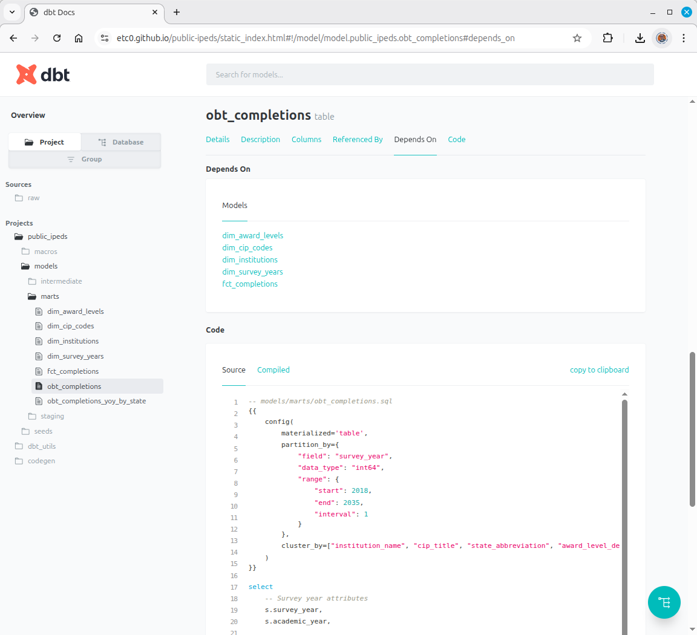

# IPEDS Data Pipeline & Analytics Platform

## Overview
End-to-end data engineering pipeline ingesting IPEDS 
(Integrated Postsecondary Education Data System) completions 
and institutional characteristics data for survey years 2018-2024
into a cloud warehouse, transforming it into an analytical data 
model, and visualizing key higher education metrics.

Supported warehouses: Snowflake or BigQuery 
Reporting BI tools: Metabase and Looker Studio

## Architecture

## Technology Stack
| Layer | Technology |
|---|---|
| Extraction | Python, requests |
| Load | Python, pandas, snowflake-connector-python or google-cloud-bigquery |
| Data Warehouse | Snowflake or GCP BigQuery |
| Transformation | dbt |
| Visualization | Metabase, Looker Studio |
| Version Control | Git/GitHub |
| Code Quality | pre-commit, dbt-checkpoint |

## Dashboards
[View Live Dashboard: Metabase](https://venus.tail59a343.ts.net/public/dashboard/abda35ce-c89e-44cf-ab7b-e6a8f212ac51) 
  

[View Live Dashboard: Looker Studio](https://lookerstudio.google.com/reporting/c4844475-0d15-406f-8cd8-cbeb03332b2b) 

## Key Features
- Automated download and decompression of IPEDS ZIP files
- Schema-driven CSV ingestion with data cleaning
- Medallion architecture (Bronze/Silver/Gold)
- Dimensional model with fact and dimension tables, along with one big tables
- dbt tests for data quality at every layer
- dbt documentation of all models
- Pre-commit hooks enforcing code quality

## Data Model
[Data Model Documentation](https://etc0.github.io/public-ipeds/static_index.html) 

### Dimensional Model
- fct_completions — grain: one row per year/institution/CIP/award level
- dim_survey_year — survey year with academic year
- dim_institution — annual snapshot of institutional characteristics
- dim_cip_code — CIP 2020 program classification with STEM flags
- dim_award_level — award level codes and categories
- obt_completions - denormalized version of the model/one big table
- obt_completions_yoy_by_state - one big table, specialized for year-over-year state growth rates

## Reports
1. Total completions trend 2018-2024
2. Completions by award level over time
3. Top 10 CIP families
4. STEM vs non-STEM trend
5. Gender gap by field of study
6. State completions by academic year
7. Top 25 institutions by completions
8. Year-over-year growth rate by state

## Setup
1. Clone this GIT repository
2. Create a Python virtual environment
3. To install Python requirements, run: `pip install -r requirements.txt` from the terminal
4. Make a copy of the .env_sample file and rename it .env
5. Update the .env file with the cloud WAREHOUSE type (either 'snowflake' or 'bigquery')
6. If using Snowflake:
    - Manually create a new database with schemas named: raw and dwh
    - Generate a Programmatic Access Token (PAT) in Snowsight under Governance & security > Users & roles
    - Update the SNOWFLAKE connection variables in the .env file. Note: set SNOWFLAKE_PASSWORD to your PAT

   If using BigQuery:
    - Manually create a GCP project named: 'data-eng-ipeds' with BigQuery datasets named: raw and dwh
    - Install the [Google Cloud CLI](https://docs.cloud.google.com/sdk/docs/install-sdk)
    - To select your project and account, from the terminal run: `gcloud init`
    - Authenticate with Google by running: `gcloud auth application-default login`
7. Install the [dbt CLI](https://docs.getdbt.com/docs/cloud/cloud-cli-installation)
8. Navigate to the dbt folder and run: `dbt init` to generate your [dbt profiles.yml](https://docs.getdbt.com/docs/local/profiles.yml) file. Note: enter `dwh` for the dbt dataset
9. Run `dbt debug` to verify the dbt connection to your warehouse

## Running
1. From a terminal in the root directory, run: `python -m ingestion.ingestion` to extract and load data into the warehouse
2. Navigate to the dbt folder and run: `dbt build` to transform the data into dimensional objects

## Notes
- The Python pandas library was used to create a dataframe as a source for loading completion data into the warehouse, since the ingestion method forced zero-padded CIP codes as float data type (e.g. 01.0105 -> 1.0105)
- Similarly, a schema.yml file was used to instruct dbt to treat CIP codes as strings, since the 'dbt seed' command by default interprets zero-padded CIP codes from the definition file as float data types.
- A filter was applied to completions data to only include students' first majors (MAJORNUM=1), as the reports do not cover secondary majors.
- The definition of STEM fields were derived from the Optional Practical Training (OPT) as set by the Department of Homeland Security (DHS): [Source Link](https://studyinthestates.dhs.gov/stem-opt-hub/additional-resources/eligible-cip-codes-for-the-stem-opt-extension)
